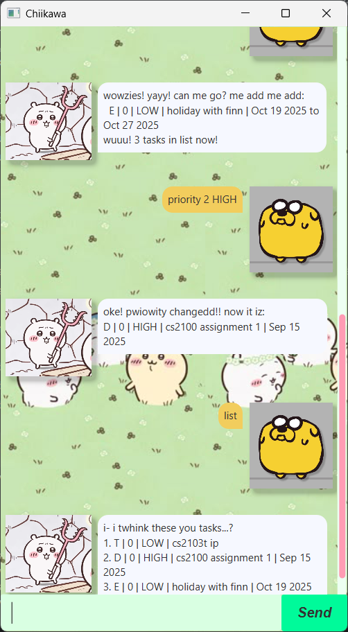

# Chiikawa🥰🐭 User Guide

ChiikawaPrime frees your mind of having to remember things you need to do. ChiikawaPrime brings only convenience to your life. ChiikawaPrime is your one stop do it all chat bot.

> **Tip:** ChiikawaPrime is your one stop do it all chat bot! 🚀

## ✨✨ Features
Chiikawa is all knowing and all powerful. Here are some of the things Chiikawa can do for you:
- ✅ Adding to do tasks
- ⏰ Adding tasks with deadlines
- 📅 Adding tasks that are events
- 🔝 Update those priorities
- 🗑️ Deleting tasks
- 🔍 Finding tasks
- 📋 Listing all tasks
- ✔️ Marking tasks as done
- ❌ Marking tasks as not done
- 💾 Saving tasks to local storage
- 📂 Loading tasks from local storage

## 📷 Screenshots

## ✅ Adding to do tasks

To Do tasks are tasks that need to be done but do not have a specific deadline or event date.
They are your everyday tasks that you need to remember.

Example: `todo <task_name>`

Chiikawa will then add the task to your list and confirm the addition.

## ⏰ Adding tasks with deadlines
Deadline tasks are tasks that need to be done by a specific date and time.

Example: `deadline <task_name> /<yyyy-mm-dd>`

Example: `deadline <task_name> /<any time>`

## 📅 Adding tasks that are events
Event tasks are tasks that occur at a specific date and time.

Example: `event <task_name> /<start time in yyyy-mm-dd> /<end time in yyyy-mm-dd>`

Example: `event <task_name> /<start time in any time> /<end time in any time>`

## 🔝 Updating priorities of tasks
You can assign priorities to your tasks to help you manage your time better. There are two levels of priority: HIGH and LOW.
By default, all tasks are assigned a LOW priority.

Example: `priority <task_number> <HIGH/LOW>`

## 🗑️ Deleting tasks
To delete a task, you need to specify the task number that you want to delete. The task number can be found by listing all tasks.

Example: `delete <task_number>`

## 🔍 Finding tasks
To find a task, you can use the find command followed by a keyword. Chiikawa will then search through your tasks and return any tasks that contain the keyword in their names.

Example: `find <keyword>`

## 📋 Listing all tasks
To list all tasks, simply use the list command. Chiikawa will then display all your tasks along with their details such as task type, priority, and status.

Example: `list`

## ✔️ Marking tasks as done
To mark a task as done, you need to specify the task number that you want to mark as done. The task number can be found by listing all tasks.

Example: `mark <task_number>`

## ❌ Marking tasks as not done
To mark a task as not done, you need to specify the task number that you want to mark as not done. The task number can be found by listing all tasks.

Example: `unmark <task_number>`

## 💾 Saving tasks to local storage
Chiikawa automatically saves your tasks to local storage whenever you exit the program. You do not need to do anything to save your tasks. You simply exit and your tasks will be saved.

Example: `bye`

## 📂 Loading tasks from local storage
Chiikawa automatically loads your tasks from local storage whenever you start the program. You do not need to do anything to load your tasks. You simply start the program and your tasks will be loaded.

Enjoy using ChiikawaPrime! If you have any questions or need further assistance, feel free to reach out to our support team.
